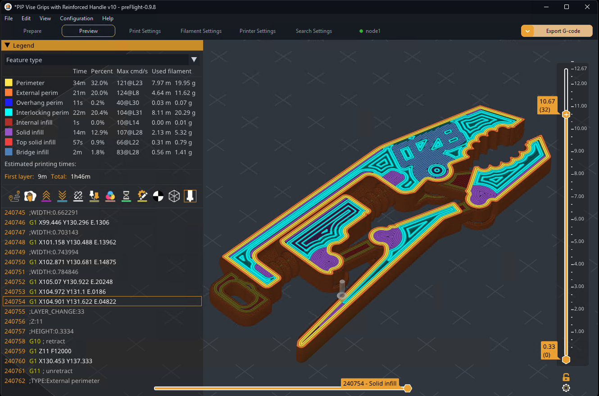

<p align="center">
  
  <br><br>
  <a href="images/gui.png"></a>
</p>

<p align="center">
  <a href="https://github.com/oozebot/preFlight/releases"></a>
  <a href="https://github.com/oozebot/preFlight/releases"></a>
  <a href="https://github.com/oozebot/preFlight/stargazers"></a>
  <a href="LICENSE"></a>
  <a href="https://preflight3d.com"></a>
  <a href="https://donate.stripe.com/eVqfZbgoVf9y1c1aXe63K00"></a>
</p>

# preFlight

**Pilot, You Are Cleared for Launch.**

preFlight is an advanced 3D printing slicer. Building on the Slic3r legacy as a spiritual successor to PrusaSlicer, it offers exclusive features and a comprehensive under-the-hood overhaul, bringing the entire dependency stack up to modern standards. Switching is easy: preFlight natively imports PrusaSlicer and OrcaSlicer profiles so you can be up and running in minutes. To put it mildly, this is no ordinary fork.

Visit **[preflight3d.com](https://preflight3d.com)** for features, screenshots, and details. Community discussion on [GitHub Discussions](https://github.com/oozebot/preFlight/discussions/categories/preflight-features) and the [Duet3D forum](https://forum.duet3d.com/category/44/preflight).

<br>

## oozeBot

Based in Georgia, USA, oozeBot is a small but ambitious team currently preparing for the take-off of our Elevate line of 3D printers. preFlight is the cornerstone of that ecosystem, but is open to all makers. It's our way of investing in a community we've been part of for over 10 years.

<br>

## Donate

While preFlight is open-source and free for everyone, your support helps us maintain the infrastructure, fund R&D, and keep our team in orbit. [Support preFlight via Stripe.](https://donate.stripe.com/eVqfZbgoVf9y1c1aXe63K00)

<br>

## Requirements

**Windows, Linux, macOS, and Raspberry Pi.**

**Windows:** Download the portable zip from [GitHub Releases](https://github.com/oozebot/preFlight/releases) and extract. Available for x64 and ARM64. Requires the [Microsoft Visual C++ Redistributable](https://aka.ms/vs/17/release/vc_redist.x64.exe) - install this first if preFlight won't launch.

**macOS:** Download the DMG from [GitHub Releases](https://github.com/oozebot/preFlight/releases). Requires macOS 11.0+ (Big Sur or later), Apple Silicon only. All builds are signed and notarized by Apple.

**Linux:** Download the AppImage from [GitHub Releases](https://github.com/oozebot/preFlight/releases), make it executable (`chmod +x`), and run. No installation required.

**Raspberry Pi:** RPi 5 running 64-bit Raspberry Pi OS (Bookworm or Trixie). Download the aarch64 .deb package from [GitHub Releases](https://github.com/oozebot/preFlight/releases).

<br>

## Security & Authenticity

To ensure the integrity of your installation and protect yourself, please follow these security guidelines:

* **Official Downloads:** Only download preFlight binaries directly from our [GitHub Releases](https://github.com/oozebot/preFlight/releases) page. We do not distribute preFlight through third-party mirror sites.
* **Verified Signature:** All official Windows binaries are digitally signed by **oozeBot, LLC** using an **Organization Validation (OV) Code Signing Certificate**. 
* **Verification:** Before running preFlight, right-click the `.exe`, select **Properties**, and navigate to the **Digital Signatures** tab. Ensure the "Name of signer" is explicitly listed as **oozeBot, LLC**.
* **Safety First:** If you receive a "Windows protected your PC" (SmartScreen) warning on a file that is *not* signed by oozeBot, LLC, do not run it and [report the issue](https://github.com/oozebot/preFlight/issues) immediately.
* **macOS Notarization:** All official macOS DMGs are signed with an **Apple Developer ID** certificate and notarized by Apple. macOS will verify the signature and notarization automatically on first launch. If Gatekeeper warns that the app is from an unidentified developer, the DMG is not an official release.
* **3MF Security:** Post-process scripts embedded in third-party 3MF files are suppressed on import (CVE-2023-47268). All 3MF extraction uses in-memory buffers, so preFlight is not affected by Zip Slip path traversal vulnerabilities.

<br>

## Building from Source

All platforms use a unified build system. Windows uses `.bat` wrappers that set up the MSVC environment, then delegate to the same underlying scripts.

### Windows

**Requires Visual Studio 2026** (VS 2022 is not supported)

```bash
# Build dependencies (first time only)
build_deps.bat

# Build release
build.bat

# Build debug (for development)
build.bat -debug
```

### Linux / macOS

```bash
# Prerequisites (macOS only)
brew install cmake ninja pkg-config

# Build dependencies (first time only)
./build_deps.sh

# Build release
./build.sh

# Build debug (for development)
./build.sh -debug
```

### Build Options

| Flag | Description |
|------|-------------|
| `-deps` | Build dependencies (alternative to running build_deps separately) |
| `-debug` | Build with debug symbols (RelWithDebInfo) |
| `-clean` | Remove build directory and rebuild from scratch |
| `-config` | Run CMake configure only, skip build |
| `-flush` | Force resource recompilation (Windows: icons, splash) |
| `-jobs N` | Number of parallel build jobs (default: auto-detect) |
| `-arch A` | Architecture override (macOS: `arm64` / `x86_64`) |

<br>

## License

preFlight is licensed under the **GNU Affero General Public License, version 3**. See [LICENSE](LICENSE) for details.

preFlight is based on [PrusaSlicer](https://github.com/prusa3d/PrusaSlicer) by Prusa Research, which is based on [Slic3r](https://github.com/slic3r/Slic3r) by Alessandro Ranellucci and the RepRap community.

<br>

## Support

- **Website:** [preflight3d.com](https://preflight3d.com)
- **Email:** [support@ooze.bot](mailto:support@ooze.bot)
- **GitHub Issues:** [github.com/oozebot/preFlight/issues](https://github.com/oozebot/preFlight/issues)
